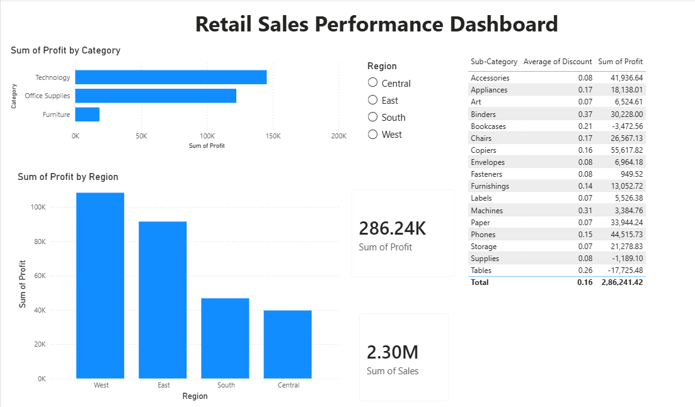

# Retail Sales Performance Analysis

End-to-end data analysis project examining sales, profit, and customer trends for a retail superstore — from raw data cleaning through SQL analysis, exploratory analysis in Python, and an interactive dashboard.

## 📌 Business Problem

As a retail analytics analyst, I was asked to answer the following questions for leadership:

1. Which regions and product categories are the most (and least) profitable?
2. Is there a seasonal pattern in sales and profit throughout the year?
3. Which customer segments generate the most revenue?
4. Are discounts hurting overall profitability, and if so, where?
5. Who are the top-performing customers and products?

## 📂 Dataset

- **Source:** [Sample Superstore Dataset](https://www.kaggle.com/datasets/vivek468/superstore-dataset-final) (Kaggle)
- **Size:** ~10,000 rows
- **Fields:** Ship Mode, Segment, Country, City, State, Postal Code, Region, Category, Sub-Category, Sales, Quantity, Discount, Profit

## 🛠️ Tools Used

| Stage | Tool |
|---|---|
| Data cleaning | Excel / Python (Pandas) |
| Querying | SQL (SQLite) |
| Exploratory analysis & visualization | Python (Pandas, Matplotlib, Seaborn) |
| Dashboard | Power BI / Tableau |
| Version control | Git & GitHub |

## 🔄 Process

1. **Data Cleaning** — Removed 17 duplicate rows, checked for missing values, standardized column names. See `data/cleaned/`.
2. **SQL Analysis** — Wrote queries to answer each business question. See `sql/analysis_queries.sql`.
3. **Exploratory Data Analysis** — Deeper analysis and visualizations in Python. See `notebooks/eda_and_analysis.ipynb`.
4. **Dashboard** — Built an interactive one-page dashboard with KPIs and filters. See `dashboard/`.
5. **Insights & Recommendations** — Summarized findings in business language. See `report/insights_summary.md`.

## 📊 Key Insights

1. West/East regions and Technology/Office Supplies categories are most profitable; Furniture drags down performance
2. Home Office segment is most profitable per order despite lower volume than Consumer
3. Discounts above ~20-25% (Tables, Bookcases, Binders) are linked to losses
4. Copiers and Phones are your standout profitable products

## 📈 Dashboard Preview

## 📁 Repository Structure
